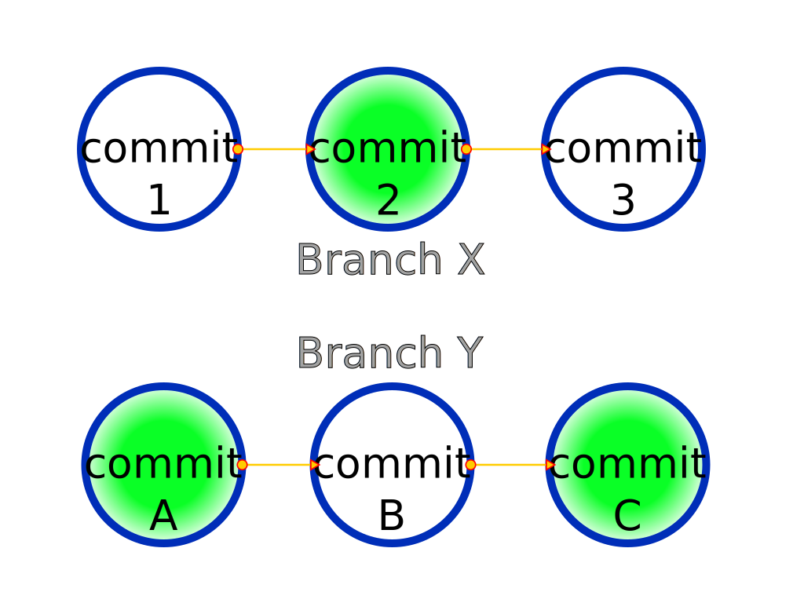

# Branches

Have you ever wondered _what if_ you had done something differently? What if you had made a different choice? What if you had taken a different path?

That's where branches come in. They allow you to explore different paths and make different decisions. You can even go back to the original path and make a different decision.

Commits in git exist on branches. Branches in git are like timelines. They are a sequence of commits. You can switch between branches to work on different timelines. You can also `merge` branches to combine timelines.

Every time you want to test out something, you can create a new branch.  
If you don't like the changes, you can delete the branch.  
Satisfied? Merge the branches.

In gaming terms, each branch represents a quest.  
You don't need to complete a side quest to move forward with the main quest. You can have any number of ongoing quests.

## Merging strategies

### Merge commit

When you merge two branches, git creates a new commit that combines the changes from both branches. This is called a merge commit.

### Rebase

> Merge commits are ugly. I don't want them.

When you merge two branches, git can rebase the branch.  
Re base => Change the base, i.e. the starting point.  
Rewrite history. Make it look like the branch was created from the latest commit of the branch you are merging into.

### Squash and merge

> What if I do not want to keep the commits I had created while testing out the changes?

Hammer (`squash`) them into a single commit and merge them.

## Merge conflicts

> What if I have made changes to the same file in both branches?

Git will try to include changes from both branches.  
However, if the changes overlap, git will not be able to merge them.  
Such a situation is called a merge conflict.

[Previous](./chapter1.md){: .btn} [Next](./chapter3.md){: .btn}
